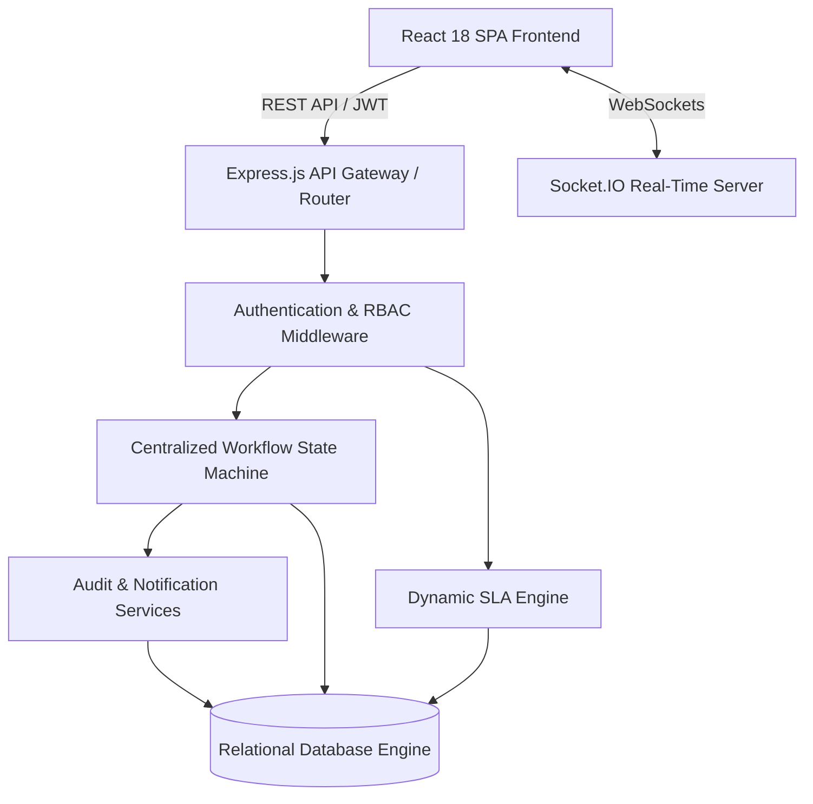
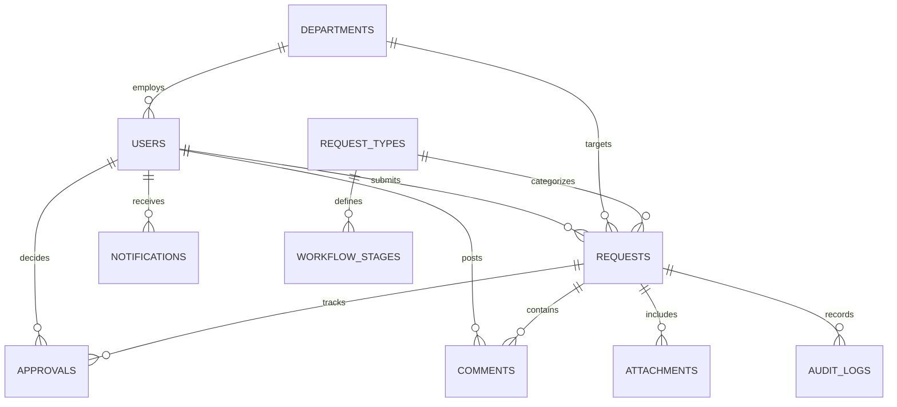

# FlowSync — Centralized Enterprise Business Workflow & Operations Management Platform

[](https://vesa.org)
[-emerald.svg)]()
[]()
[]()

> **FlowSync Enterprise** is a production-quality centralized business workflow and operations management engine designed for mid-sized organizations with 500+ employees. It replaces fragmented email threads, paper forms, and unmonitored messaging apps with ONE centralized request engine supporting multi-tier approvals, continuous SLA countdown tracking, server-enforced role-based access control (RBAC), and real-time WebSocket notifications.

---

## 1. Problem Understanding & Business Context

Growing mid-sized organizations with 500+ employees frequently suffer from severe operational friction when internal requests are managed across unmonitored channels—such as email threads, ad-hoc spreadsheets, paper forms, and instant messaging apps.

### Key Operational Challenges:
- **Zero Process Visibility**: Employees have no clear visibility into request status, approval bottlenecks, or responsible handlers.
- **Approval Governance Violations**: Informal channels allow employees to bypass approval hierarchies or self-approve requests without managerial sign-off.
- **SLA Breach Risks**: Organizations lack real-time SLA countdown tracking, resulting in overdue software access, delayed reimbursement payouts, and stuck procurement tasks.
- **Missing Audit Trails**: Compliance officers and department heads cannot trace historical state changes, decision comments, or file attachments.

---

## 2. Proposed Solution

**FlowSync** replaces these fragmented channels with a **Single Unified Enterprise Request Engine**. Built as a high-performance REST API and modern React Single Page Application (SPA), the platform orchestrates all organizational requests through a centralized state machine supporting 4 mandatory business processes:

1. **Software Access Request** (24h Target SLA): 2-Stage Pipeline (Reporting Manager Approval &rarr; IT Administrator Provisioning).
2. **Expense Reimbursement** (48h Target SLA): 3-Stage Pipeline (Reporting Manager Review &rarr; Finance Audit & Verification &rarr; Reimbursement Payout Processing).
3. **Document Approval** (72h Target SLA): 3-Stage Pipeline (Department Manager Review &rarr; Department Director Approval &rarr; Final Governance Sign-off).
4. **Equipment Request** (72h Target SLA): 3-Stage Pipeline (Reporting Manager Approval &rarr; IT Availability Check &rarr; Inventory Allocation / Procurement).

---

## 3. Stakeholders & System Personas

| Role Code | Representative User | Primary Responsibilities | Scope of Access |
| :--- | :--- | :--- | :--- |
| **`EMPLOYEE`** | Aarav Sharma | Submits requests, provides details, uploads receipts/documents, tracks live progress | Restricted strictly to own created requests |
| **`REPORTING_MANAGER`** | Vikram Singh | Reviews team requests, validates justifications, approves/rejects (reason required), or requests changes | Direct report team members and own requests |
| **`DEPARTMENT_STAFF`** | Karan Patel (IT) / Sunita Joshi (Fin) | Fulfills operational tasks (e.g. software provisioning, expense payouts, inventory allocation) | Department-specific operational work queues |
| **`DEPARTMENT_HEAD`** | Meera Nair (Ops Director) | Executive approval authority for high-value reimbursements and policy document governance | Department governance & executive approval queues |
| **`OPERATIONS_MANAGER`** | Siddharth Malhotra | Organization-wide analytics, SLA compliance monitoring, bottleneck detection, operational reports | Organization-wide analytics & SLA metrics |
| **`SYSTEM_ADMIN`** | System Admin User | Full system access, configuration, user role management, audit logging | Unrestricted global system access |

---

## 4. Key Engineering Features

- **Centralized Reusable State Machine Engine**: Enforces strict backend state transitions (`SUBMITTED` &rarr; `UNDER_REVIEW` &rarr; `APPROVAL_PENDING` &rarr; `APPROVED` &rarr; `PROCESSING` &rarr; `COMPLETED` / `REJECTED` / `CHANGES_REQUESTED` / `CANCELLED`).
- **Dynamic Real-Time SLA Engine**: Dynamic timestamp calculation for 24h, 48h, and 72h targets. Renders live countdown badges (`WITHIN_SLA`, `APPROACHING_SLA`, `OVERDUE`).
- **Strict Business Rules & Self-Approval Prohibition**: Server-side RBAC middleware prevents users from approving their own requests (HTTP `403`), requires written reasons on rejection (HTTP `400`), and retains version history on change requests.
- **Authenticated Socket.IO WebSockets**: Instant push notification emission on status changes to user-specific (`user_${id}`), department-specific (`dept_${id}`), and role-specific (`role_${role}`) WebSocket rooms.
- **Evaluator Persona Quick-Switcher**: Evaluators can instantly switch between all 6 system roles directly from the top navigation bar to test permission boundaries live.
- **Interactive Visual Timeline & Audit Trail**: Visual step-by-step progress pipeline bar and immutable chronological audit log.

---

## 5. Technology Stack

- **Frontend**: React 18, Vite 6, Tailwind CSS, Lucide Icons, React Router 6, Socket.IO Client.
- **Backend**: Node.js, Express.js, Socket.IO, JWT, Bcrypt.js, Helmet, Express Rate Limit, Zod validation, Multer.
- **Database & Persistence**: Relational SQLite / DDL Engine with foreign key constraints, index lookups, and atomic disk persistence (`data/workflow.db`).
- **Testing**: Node.js Native Test Runner (`node --test`), Supertest for REST API integration testing.
- **CI/CD Pipeline**: GitHub Actions matrix workflow (`.github/workflows/ci.yml`).

---

## 6. System Architecture & Database Design

### System Architecture Diagram


### Relational Entity Relationship Diagram (ERD)


---

## 7. API Overview & Key Endpoints

| HTTP Method | Endpoint | Allowed Roles | Description |
| :--- | :--- | :--- | :--- |
| `POST` | `/api/auth/login` | Public | Authenticate user credentials & return JWT token |
| `GET` | `/api/auth/me` | Authenticated | Retrieve current user profile context |
| `POST` | `/api/requests` | All Roles | Create a new workflow request (software, expense, doc, equipment) |
| `GET` | `/api/requests` | All Roles (Scoped) | Query requests list (filtered by role scope, status, search, SLA) |
| `GET` | `/api/requests/:id` | Scoped Access | Get full request workspace (timeline, approvals, comments, files) |
| `POST` | `/api/requests/:id/action` | Authorized Roles | Execute state transition (`APPROVE`, `REJECT`, `START_PROCESSING`, `COMPLETE_TASK`) |
| `POST` | `/api/requests/:id/comments` | Scoped Access | Add a comment to request workspace |
| `POST` | `/api/attachments/:requestId` | Scoped Access | Upload file attachment (PDF, Image, Doc) |
| `GET` | `/api/attachments/download/:id`| Scoped Access | Securely stream attachment file |
| `GET` | `/api/analytics/dashboard` | All Roles (Scoped) | Retrieve dashboard metrics and bottleneck stats |
| `GET` | `/api/audit` | Admin / Ops | Query immutable audit logs |
| `GET` | `/api/health` | Public | System health check endpoint |

---

## 8. Quick Setup & Local Execution Instructions

### Prerequisites
- Node.js v18+ and npm installed.

### 1. Backend API & WebSockets Server Setup
```bash
cd backend
npm install
npm run seed
npm start
```
*Backend runs on `http://localhost:5000` (WebSockets active on port 5000).*

### 2. Frontend React UI Setup
```bash
cd frontend
npm install
npm run dev
```
*Frontend runs on `http://localhost:3000`.*

### 3. Run Automated Integration Test Suite
```bash
cd backend
npm test
```

---

## 9. Demo Credentials & Persona Quick-Select

| Role Persona | Email Address | Password |
| :--- | :--- | :--- |
| **Employee (Aarav Sharma)** | `aarav.sharma@enterprise.com` | `Password123!` |
| **Reporting Manager (Vikram Singh)** | `vikram.singh@enterprise.com` | `Password123!` |
| **IT Administrator (Karan Patel)** | `it.admin@enterprise.com` | `Password123!` |
| **Finance Officer (Sunita Joshi)** | `finance.officer@enterprise.com` | `Password123!` |
| **Department Director (Meera Nair)** | `director.ops@enterprise.com` | `Password123!` |
| **Operations Manager (Siddharth Malhotra)** | `ops.manager@enterprise.com` | `Password123!` |
| **System Administrator (Admin)** | `sys.admin@enterprise.com` | `Password123!` |

> [!TIP]
> Use the **Quick Persona Switcher** dropdown in the top header bar to switch roles with a single click during testing!

---

## 10. Documentation Sitemap (`docs/`)

Detailed technical specifications and architectural documentation are available in the [`docs/`](./docs) directory:
- [PDF Submission Document](./VESA_Operations_Frontend_Project_Documentation.pdf)
- [System Architecture Specification](./docs/ARCHITECTURE.md)
- [Entity Relationship Diagram & Schema](./docs/ER_DIAGRAM.md)
- [REST API Endpoint Documentation](./docs/API_DOCUMENTATION.md)
- [RBAC Permission Matrix](./docs/RBAC_MATRIX.md)
- [Workflow State Machine Design](./docs/WORKFLOW_DESIGN.md)
- [SLA Formula Specification](./docs/SLA_DESIGN.md)
- [Automated Testing Report](./docs/TESTING.md)
- [Autonomous QA & Debugging Log](./docs/FINAL_QA_REPORT.md)
- [Engineering Assessment Report](./docs/PROJECT_REPORT.md)
- [Security & File Protection](./docs/SECURITY.md)
- [Deployment Configuration](./docs/DEPLOYMENT.md)
- [Project Assumptions](./docs/ASSUMPTIONS.md)

---

## 11. Testing & Quality Assurance Summary

Command: `npm test` inside `backend/`

```
# tests 15
# suites 5
# pass 15
# fail 0
# duration_ms 1243.6189
```
- **Pass Rate**: **100% (15 / 15 Tests Passed)**
- **Coverage**: Authentication, Request Creation, State Machine Boundaries, Self-Approval Prevention, Rejection Reason Checks, Operational Role Guards, Manager Scoping, Analytics.

---

## 12. Deployment & Environment Configuration

### Production Build Command:
```bash
cd frontend && npm run build
```
*(Outputs optimized bundle into `frontend/dist`).*

### Environment Variables (`backend/.env.example` & `frontend/.env.example`):
```env
PORT=5000
NODE_ENV=production
JWT_SECRET=vesa_enterprise_workflow_secure_jwt_secret_key_2026_prod
JWT_EXPIRES_IN=24h
DB_PATH=data/workflow.db
UPLOAD_DIR=uploads
VITE_API_URL=http://localhost:5000/api
```

---

## 13. Future Enhancements

1. **Drag-and-Drop Visual Workflow Builder**: Enable administrators to build custom multi-stage approval pipelines visually.
2. **FCM Mobile Native Push Notifications**: Extend Socket.IO dispatcher to send mobile push notifications for urgent SLA deadlines.
3. **Multi-Currency Exchange Rate Sync**: Real-time currency conversions for international travel expense reimbursements.

---

## 14. License & VESA Project Submission

Prepared for **VESA Skill Development Program — Project 3 (Business Workflow & Operations Management Platform)**.
All code, documentation, and test suites are verified and ready for evaluation.
