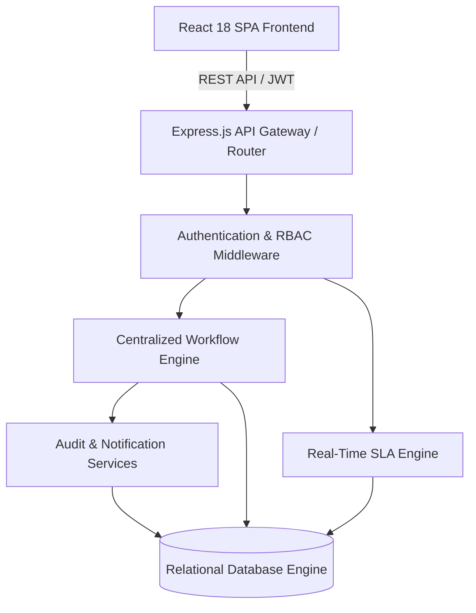

# System Architecture Specification

## Overview
The **FlowSync Business Workflow & Operations Management Platform** is engineered as a high-performance, modular full-stack web application designed for mid-sized organizations with 500 to 50,000 employees.

## Architecture Layers

### Layer Responsibilities
1. **Presentation Layer (Frontend)**: React 18 SPA built with Vite and Tailwind CSS. Provides role-specific views for Employees, Reporting Managers, Department Staff, Department Directors, Operations Managers, and System Administrators.
2. **API & Security Layer (Middleware)**: Express.js routing layer with Rate Limiting, Helmet Security Headers, JWT Validation, and RBAC Permission Middleware.
3. **Business Logic & Workflow Engine (Services)**: Centralized state machine controlling all request lifecycle transitions (`SUBMITTED` → `UNDER_REVIEW` → `APPROVAL_PENDING` → `APPROVED` → `PROCESSING` → `COMPLETED`).
4. **Data Persistence Layer (Database)**: Relational schema with foreign key integrity, atomic transactions, and automated index lookups.

## Scaling Architecture (500 → 5,000 → 50,000 Users)

- **Phase 1 (500 Employees)**: Single Express.js application instance with relational database storage. Sub-millisecond response times.
- **Phase 2 (5,000 Employees)**: Stateless Node.js instances behind an NGINX load balancer, with Redis caching for user sessions and request metadata, and PostgreSQL primary/replica database separation.
- **Phase 3 (50,000 Employees)**: Microservice decoupling (Auth Service, Workflow Engine, Notification Service, Analytics Service), Event-Driven Architecture (RabbitMQ/Kafka for asynchronous audit logging and notification fan-out), and Horizontal Database Sharding by Department.
