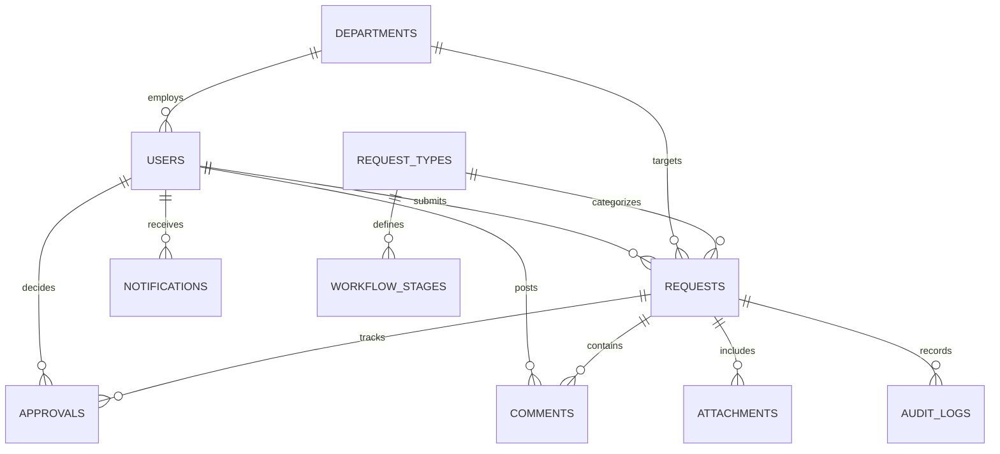

# Database Schema & Entity Relationship (ER) Diagram

## Entity Relationship Diagram (ERD)

## Relational Schema Specifications

### `users`
- `id`: Primary Key (INTEGER, Auto-Increment)
- `email`: VARCHAR(255), Unique Index
- `password_hash`: VARCHAR(255), Bcrypt hash
- `full_name`: VARCHAR(255)
- `role`: ENUM('EMPLOYEE', 'REPORTING_MANAGER', 'DEPARTMENT_STAFF', 'DEPARTMENT_HEAD', 'SYSTEM_ADMIN', 'OPERATIONS_MANAGER')
- `department_id`: Foreign Key -> `departments.id`
- `manager_id`: Foreign Key -> `users.id` (Self-referential)

### `requests`
- `id`: Primary Key (INTEGER, Auto-Increment)
- `request_number`: VARCHAR(50), Unique Index (e.g. `REQ-2026-00001`)
- `request_type_code`: Foreign Key -> `request_types.code`
- `user_id`: Foreign Key -> `users.id`
- `department_id`: Foreign Key -> `departments.id`
- `current_stage`: VARCHAR(100)
- `status`: ENUM('SUBMITTED', 'UNDER_REVIEW', 'APPROVAL_PENDING', 'APPROVED', 'PROCESSING', 'COMPLETED', 'REJECTED', 'CHANGES_REQUESTED', 'CANCELLED')
- `priority`: ENUM('LOW', 'MEDIUM', 'HIGH', 'URGENT')
- `title`: VARCHAR(255)
- `description`: TEXT
- `custom_fields`: JSON
- `created_at`: TIMESTAMP
- `updated_at`: TIMESTAMP
- `completed_at`: TIMESTAMP (Nullable)
