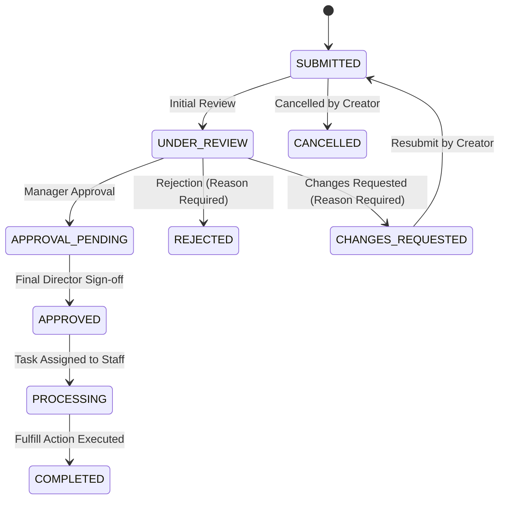

# Core Workflow Specifications & State Machine Design

## Universal Lifecycle State Diagram

## Mandatory Workflows

### 1. Software Access Request
- **Approval Chain**: `Employee` → `Reporting Manager` → `IT Administrator` → `Completed`
- **Rules**: Manager validates business justification; IT provisions license and access level.

### 2. Expense Reimbursement
- **Approval Chain**: `Employee` → `Reporting Manager` → `Finance Officer` → `Reimbursement Processing` → `Completed`
- **Rules**: Manager checks purpose; Finance verifies itemized receipt and processes payout.

### 3. Document Approval
- **Approval Chain**: `Employee` → `Department Manager` → `Department Director` → `Final Approval` → `Completed`
- **Rules**: Multi-tier sign-off; requesting changes preserves document versioning and audit trail.

### 4. Equipment Request
- **Approval Chain**: `Employee` → `Reporting Manager` → `IT / Admin` → `Inventory Allocation / Procurement` → `Completed`
- **Rules**: IT assesses stock availability:
  - Inventory available → Assign & Complete
  - Inventory unavailable → Escalate to Procurement → Record PO/Receipt → Complete
